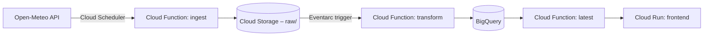

# GCP Data Pipeline

[](https://github.com/mohammed-taha-el-ahmar/gcp-data-pipeline/actions/workflows/ci.yml)

> Part of a multi-cloud data engineering pattern — see `PORTFOLIO.md` in the
> companion repos for the cross-cloud comparison. Same `shared/` ingest +
> transform logic as `aws-data-pipeline`, `azure-data-pipeline`, and
> `k8s-airflow-data-platform`.

```
API → Cloud Storage → BigQuery → Dashboard
```

## Architecture



| Component | Path | Purpose |
|-----------|------|---------|
| **Shared logic** | `shared/` | Cloud-agnostic ingest + transform |
| **Ingest function** | `functions/ingest/` | HTTP-triggered, writes raw JSON to GCS |
| **Transform function** | `functions/transform/` | GCS-event-triggered, loads rows into BQ |
| **Latest function** | `functions/latest/` | HTTP, returns most recent BQ row as JSON |
| **Front end** | `frontend/` | Static dashboard on Cloud Run (nginx container) |
| **Infrastructure** | `terraform/` | All GCP resources via Terraform |

---

## Prerequisites

| Tool | Version | Install |
|------|---------|---------|
| Python | ≥ 3.12 | — |
| [uv](https://docs.astral.sh/uv/) | latest | `curl -LsSf https://astral.sh/uv/install.sh \| sh` |
| Terraform | ≥ 1.5 | `brew install terraform` |
| gcloud CLI | latest | https://cloud.google.com/sdk/docs/install |

---

## Quick Start

```bash
# 1. Clone
git clone <repo-url> && cd gcp-data-pipeline

# 2. Install Python deps (creates .venv from committed uv.lock)
uv sync

# 3. Run lint + format check
uv run ruff check .
uv run ruff format --check .

# 4. Run tests
uv run pytest                        # all tests
uv run pytest -m smoke               # smoke only (hits live API)
uv run pytest tests/test_shared.py   # unit only

# 5. Package Cloud Functions
uv run python scripts/package_functions.py
# => build/ingest.zip, build/transform.zip, build/latest.zip
```

---

## Deploy to GCP

```bash
# Authenticate
gcloud auth login
gcloud auth application-default login

# Set your project
gcloud config set project YOUR_PROJECT_ID

# Enable required APIs (must be done before terraform apply)
gcloud services enable \
  cloudfunctions.googleapis.com \
  cloudbuild.googleapis.com \
  run.googleapis.com \
  artifactregistry.googleapis.com \
  cloudscheduler.googleapis.com \
  eventarc.googleapis.com \
  storage.googleapis.com \
  bigquery.googleapis.com

# Package functions first
uv run python scripts/package_functions.py

# Terraform — first pass: create buckets + BQ + IAM
cd terraform
cp terraform.tfvars.example terraform.tfvars   # set your project ID
terraform init
terraform apply -target=google_storage_bucket.function_source \
               -target=google_storage_bucket.data_lake \
               -target=google_bigquery_dataset.warehouse \
               -target=google_bigquery_table.observations \
               -target=google_artifact_registry_repository.repo \
               -target=google_project_iam_member.functions_bq_editor \
               -target=google_project_iam_member.functions_storage_viewer

# Upload function zips to the source bucket
BUCKET=$(terraform output -raw function_source_bucket)
gsutil cp ../build/ingest.zip    gs://$BUCKET/ingest.zip
gsutil cp ../build/transform.zip gs://$BUCKET/transform.zip
gsutil cp ../build/latest.zip    gs://$BUCKET/latest.zip

# Build & push the frontend container to Artifact Registry
REGION=europe-west1
PROJECT=$(grep gcp_project_id terraform.tfvars | cut -d'"' -f2)
IMAGE="$REGION-docker.pkg.dev/$PROJECT/multicloud-pipeline-repo/frontend:latest"

gcloud auth configure-docker "$REGION-docker.pkg.dev" --quiet
cd ../frontend
docker build -t "$IMAGE" .
docker push "$IMAGE"
cd ../terraform

# Full apply — creates functions, scheduler, Cloud Run
terraform apply
```

After deploy, the scheduler invokes ingest every hour. You can also trigger
manually:

```bash
curl -X POST "$(terraform output -raw ingest_function_url)"

# Open the dashboard
echo "Frontend: $(terraform output -raw frontend_url)"
```

---

## Demo

### Run the pipeline locally (no GCP needed)

```bash
# Fetch data + transform in one shot
uv run python -c "
from shared.ingest import fetch_data, to_raw_record
from shared.transform import transform_record
import json

raw = to_raw_record(fetch_data())
print('=== Raw record ===')
print(json.dumps(raw, indent=2))

row = transform_record(raw)
print('\n=== Warehouse row ===')
print(json.dumps(row, indent=2))
"
```

### Run the ingest function locally

```bash
cd functions/ingest
DATA_LAKE_BUCKET=test-bucket \
  uv run functions-framework --target ingest --port 8080 &

# Hit it
curl http://localhost:8080
kill %1
```

### Run the latest function locally

```bash
cd functions/latest
BQ_DATASET=weather_pipeline BQ_TABLE=weather_observations \
  uv run functions-framework --target latest --port 8081
# (Requires GOOGLE_APPLICATION_CREDENTIALS to be set)
```

### Run the frontend locally (Docker)

```bash
cd frontend
docker build -t pipeline-frontend .
docker run --rm -p 8080:8080 pipeline-frontend
# Open http://localhost:8080
```

---

## CI

GitHub Actions runs on every push/PR to `main`:

| Job | What it does |
|-----|--------------|
| **lint** | `ruff format --check` + `ruff check` |
| **test** | `pytest` unit + smoke tests |
| **terraform** | `terraform fmt -check` + `validate` |

See [`.github/workflows/ci.yml`](.github/workflows/ci.yml).

---

## Project Layout

```
.
├── .github/workflows/ci.yml     # GitHub Actions CI
├── frontend/
│   ├── Dockerfile                # nginx container for Cloud Run
│   ├── nginx.conf                # nginx config (port 8080)
│   └── index.html                # Static dashboard
├── functions/
│   ├── ingest/main.py            # Cloud Function: ingest
│   ├── transform/main.py         # Cloud Function: transform
│   └── latest/main.py            # Cloud Function: latest row API
├── scripts/
│   └── package_functions.py      # Builds deployment zips
├── shared/
│   ├── ingest.py                 # Portable ingest logic
│   └── transform.py              # Portable transform logic
├── terraform/                    # IaC
├── tests/
│   ├── test_shared.py            # Unit tests
│   └── test_smoke.py             # Smoke / integration tests
├── pyproject.toml                # uv + ruff + pytest config
├── uv.lock                       # Locked deps (committed)
└── README.md
```

---

## Useful Commands

```bash
# ─── Development ───────────────────────────────────────────────
uv sync                              # Install/update all deps
uv run ruff check . --fix            # Auto-fix lint issues
uv run ruff format .                 # Format code
uv run pytest -v                     # Verbose test run
uv run pytest --tb=short -q          # Quick summary

# ─── Packaging ─────────────────────────────────────────────────
uv run python scripts/package_functions.py   # Build zips
ls -lh build/*.zip                           # Verify artifacts

# ─── GCP Auth & Config ────────────────────────────────────────
gcloud auth login                    # Authenticate CLI
gcloud auth application-default login # Authenticate libraries/Terraform
gcloud config set project PROJECT_ID # Set active project
gcloud projects list                 # List your projects
gcloud services list --enabled       # Show enabled APIs

# ─── Enable APIs (run once per project) ───────────────────────
gcloud services enable \
  cloudfunctions.googleapis.com cloudbuild.googleapis.com \
  run.googleapis.com artifactregistry.googleapis.com \
  cloudscheduler.googleapis.com eventarc.googleapis.com \
  storage.googleapis.com bigquery.googleapis.com

# ─── Terraform ─────────────────────────────────────────────────
cd terraform
terraform init                       # Initialize providers
terraform plan                       # Preview changes
terraform apply                      # Deploy
terraform output                     # Show URLs / bucket names
terraform destroy                    # Teardown everything
terraform state list                 # List managed resources

# ─── Upload function zips ──────────────────────────────────────
BUCKET=$(terraform output -raw function_source_bucket)
gsutil cp ../build/ingest.zip    gs://$BUCKET/ingest.zip
gsutil cp ../build/transform.zip gs://$BUCKET/transform.zip
gsutil cp ../build/latest.zip    gs://$BUCKET/latest.zip

# ─── BigQuery ──────────────────────────────────────────────────
bq query --use_legacy_sql=false \
  'SELECT * FROM weather_pipeline.weather_observations ORDER BY ingested_at DESC LIMIT 5'
bq show weather_pipeline.weather_observations   # Table schema & stats

# ─── Cloud Functions ───────────────────────────────────────────
gcloud functions list --gen2 --region europe-west1
gcloud functions logs read multicloud-pipeline-ingest --gen2 --region europe-west1
gcloud functions logs read multicloud-pipeline-transform --gen2 --region europe-west1
gcloud functions logs read multicloud-pipeline-latest --gen2 --region europe-west1

# ─── Invoke functions manually ─────────────────────────────────
curl -X POST "$(terraform output -raw ingest_function_url)"
curl "$(terraform output -raw latest_function_url)"

# ─── Cloud Run (frontend) ─────────────────────────────────────
gcloud run services list --region europe-west1
gcloud run services describe multicloud-pipeline-frontend --region europe-west1
gcloud run services logs read multicloud-pipeline-frontend --region europe-west1
echo "Frontend URL: $(terraform output -raw frontend_url)"

# ─── Docker / Artifact Registry ────────────────────────────────
gcloud auth configure-docker europe-west1-docker.pkg.dev --quiet
docker build -t IMAGE_TAG frontend/
docker push IMAGE_TAG

# ─── Cloud Build logs (debug function deploy failures) ─────────
gcloud builds list --region=europe-west1 --limit=5
gcloud builds log BUILD_ID --region=europe-west1
```

---

## Troubleshooting

### `zsh: command not found: gcloud`

Install the Google Cloud SDK:

```bash
brew install --cask google-cloud-sdk
```

Then restart your terminal or run `source ~/.zshrc`.

### `Unknown project id: your-gcp-project-id`

You forgot to edit `terraform/terraform.tfvars`. Replace the placeholder:

```bash
cd terraform
# Find your project ID
gcloud projects list
# Edit the file
echo 'gcp_project_id = "YOUR-ACTUAL-PROJECT-ID"' > terraform.tfvars
```

### `Error 412: Request violates constraint 'constraints/storage.uniformBucketLevelAccess'`

Your GCP organization enforces uniform bucket-level access. The Terraform
config already sets `uniform_bucket_level_access = true` — if you see this
error, make sure you're on the latest `main.tf`.

### GCS bucket name too long (>63 characters)

GCS bucket names max out at 63 chars. The naming pattern uses
`${project_name}-datalake-${project_id}`. If your project ID is long,
shorten `project_name` in `terraform.tfvars`:

```hcl
project_name = "pipeline"  # shorter prefix
```

### `API has not been used in project … or it is disabled`

Enable all required APIs before running `terraform apply`:

```bash
gcloud services enable \
  cloudfunctions.googleapis.com \
  cloudbuild.googleapis.com \
  run.googleapis.com \
  artifactregistry.googleapis.com \
  cloudscheduler.googleapis.com \
  eventarc.googleapis.com \
  storage.googleapis.com \
  bigquery.googleapis.com
```

Wait 1–2 minutes after enabling for propagation.

### `Service account …@appspot.gserviceaccount.com does not exist`

Your project doesn't have an App Engine default service account. The
Terraform config uses the Compute Engine default SA instead
(`PROJECT_NUMBER-compute@developer.gserviceaccount.com`). If you see this
error, make sure you're on the latest `main.tf`.

### Eventarc permission denied / `eventarc.events.receiveEvent`

After enabling the Eventarc API, the service agent needs a few minutes
to propagate. If it persists, grant the roles manually:

```bash
PROJECT_NUM=$(gcloud projects describe YOUR_PROJECT --format="value(projectNumber)")

# Initialize the GCS service agent (required before granting roles)
gcloud storage service-agent --project=YOUR_PROJECT

# GCS → Pub/Sub (needed for Eventarc to receive storage events)
gcloud projects add-iam-policy-binding YOUR_PROJECT \
  --member="serviceAccount:service-${PROJECT_NUM}@gs-project-accounts.iam.gserviceaccount.com" \
  --role="roles/pubsub.publisher"

# Compute SA needs eventReceiver + run.invoker on the transform function
gcloud projects add-iam-policy-binding YOUR_PROJECT \
  --member="serviceAccount:${PROJECT_NUM}-compute@developer.gserviceaccount.com" \
  --role="roles/eventarc.eventReceiver"

gcloud run services add-iam-policy-binding multicloud-pipeline-transform \
  --region=europe-west1 \
  --member="serviceAccount:${PROJECT_NUM}-compute@developer.gserviceaccount.com" \
  --role="roles/run.invoker"
```

### Cloud Function build failure with empty logs

This usually means Cloud Build couldn't start. Check:

1. Cloud Build API is enabled
2. Wait 2–3 minutes after enabling APIs, then retry
3. Check build logs:

```bash
gcloud builds list --region=europe-west1 --limit=5
gcloud builds log BUILD_ID --region=europe-west1
```

### `Could not clone object *.zip … No such object`

The function zips must exist in the source bucket **before** Terraform
creates the Cloud Functions. Use a targeted apply first:

```bash
terraform apply -target=google_storage_bucket.function_source
BUCKET=$(terraform output -raw function_source_bucket)
gsutil cp ../build/ingest.zip gs://$BUCKET/ingest.zip
gsutil cp ../build/transform.zip gs://$BUCKET/transform.zip
gsutil cp ../build/latest.zip gs://$BUCKET/latest.zip
terraform apply
```

### `cannot destroy table … without setting deletion_protection=false`

The BigQuery table has `deletion_protection = false` in the current config.
If you see this error on an older state, apply the config change first:

```bash
terraform apply   # updates deletion_protection
terraform destroy # now works
```

### `ModuleNotFoundError: No module named 'shared'`

The Cloud Functions packaging step must bundle `shared/` inside each zip.
Re-run `uv run python scripts/package_functions.py` and redeploy the zips.

### Smoke tests fail with `URLError` / timeout

The smoke test hits the live Open-Meteo API. If you're behind a corporate
proxy or firewall, set `HTTPS_PROXY` / `HTTP_PROXY` env vars, or skip:

```bash
uv run pytest -m "not smoke"
```

### `403 Forbidden` on the latest endpoint

Ensure the `google_cloud_run_service_iam_member.latest_invoker` resource is
applied (it grants `allUsers` invoke access). Alternatively, pass an
identity token:

```bash
curl -H "Authorization: Bearer $(gcloud auth print-identity-token)" \
  "$(terraform output -raw latest_function_url)"
```

### BigQuery insert errors in transform function logs

Check that the compute default service account has
`roles/bigquery.dataEditor`. Verify with:

```bash
PROJECT_NUMBER=$(gcloud projects describe YOUR_PROJECT --format="value(projectNumber)")
gcloud projects get-iam-policy YOUR_PROJECT \
  --flatten="bindings[].members" \
  --filter="bindings.members:${PROJECT_NUMBER}-compute@developer.gserviceaccount.com"
```

### `bigquery.jobs.create permission` error in latest/transform logs

The functions need `roles/bigquery.jobUser` (to run queries) **in addition
to** `roles/bigquery.dataEditor` (to insert rows). The Terraform config
grants both — if you deployed from an older version, add it manually:

```bash
PROJECT_NUM=$(gcloud projects describe YOUR_PROJECT --format="value(projectNumber)")
gcloud projects add-iam-policy-binding YOUR_PROJECT \
  --member="serviceAccount:${PROJECT_NUM}-compute@developer.gserviceaccount.com" \
  --role="roles/bigquery.jobUser"
```

### `uv sync` fails

Make sure you're running Python ≥ 3.12:

```bash
python3 --version
uv python install 3.12   # if needed
uv sync
```

---

## Teardown

```bash
cd terraform
terraform destroy
```

---

## License

MIT
