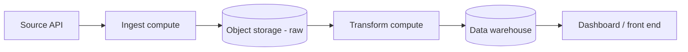
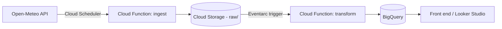

# Architecture

## Generic pattern

## GCP

This repo is one leg of a multi-cloud pattern — see also `aws-data-pipeline`,
`azure-data-pipeline`, and `k8s-airflow-data-platform`. Same `shared/` ingest
+ transform logic, GCP-native wiring.
